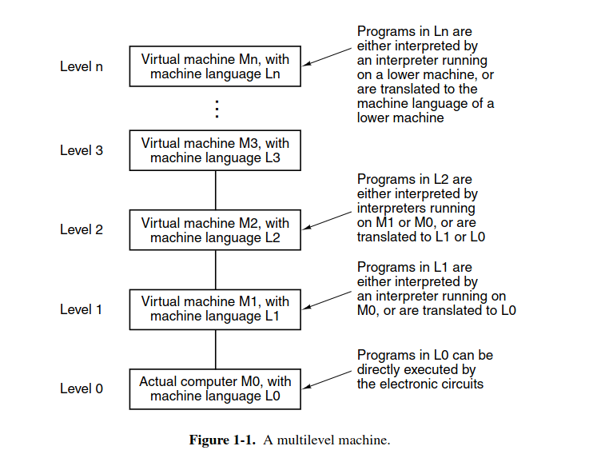
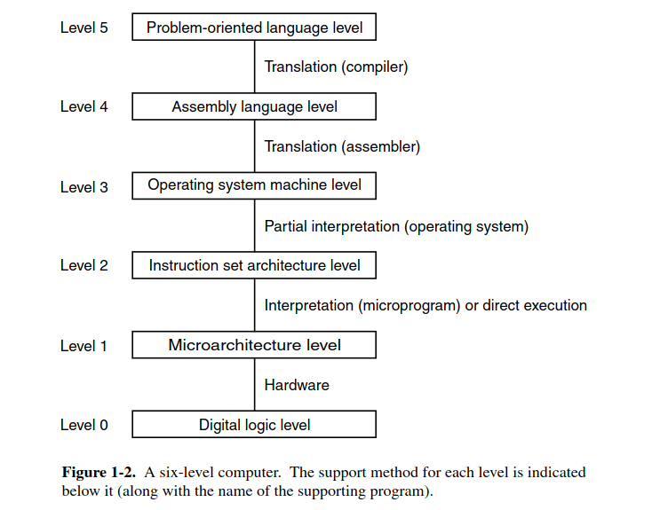

L0 - instructions for computers - unfriendly for human
L1 - human instructions - unfriendly for computer

===> need a way to translate between those two

**Translate**: first generate all the L0 code from L1, then run
**Interpret**: run and compile, without first generating

the computer is design with a series of levels, each one built on top of it predecessors, each level aim to a different objective and a distinct set of operations. the programmers only interacting with the highest level

