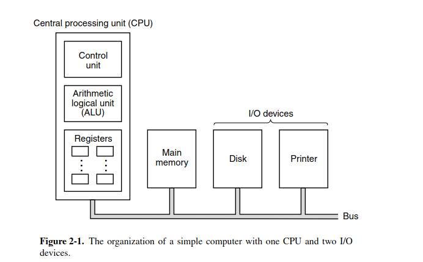
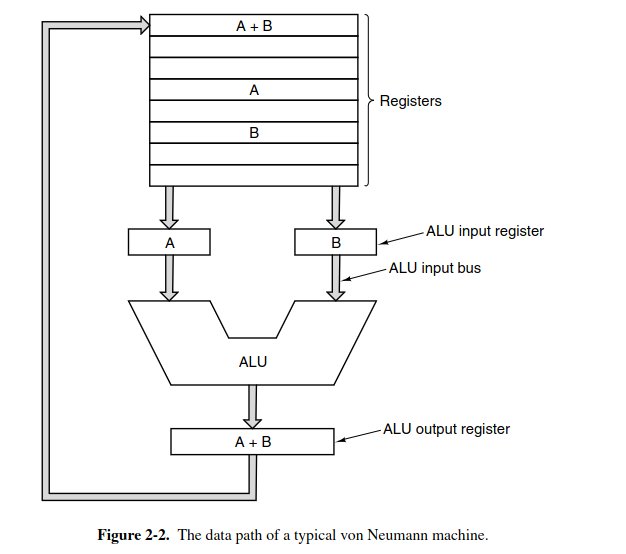

# CPU components

a typical CPU can contain those components:
- control unit - fetching instruction from main memory
- arithmetic logical unit - ALU - for computing (addition, boolean, AND,...)
- register - a small, fast memory to access

all computer's components communicate through **bus** 

two most important register:
- **Program Counter** (PC) - pointing to next instruction to execute
- **Instruction Register** (IR) - hold current instruction to be executed

# CPU datapath

