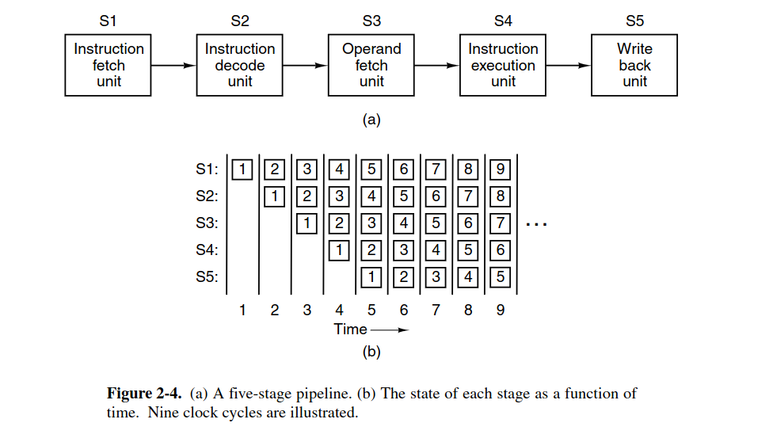
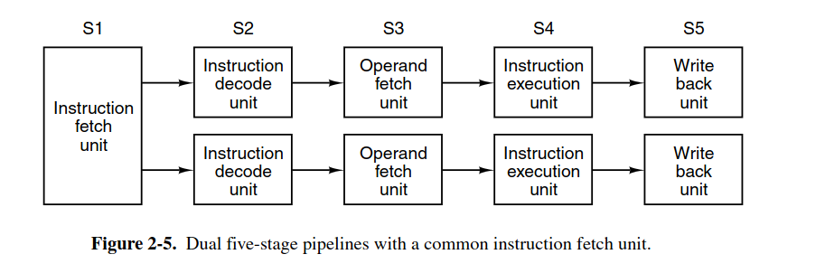

with the enable of parallelism from hardware, the CPU can do multiple work at a time 

# Instruction level parallelism

**Pipelining**:
the execution of a program can be divide into multiple stages

pipelining is a technique, which can utilize CPU parallel ability. But it is a tradeoff between latency and bandwith

**Superscalar Architectures**

instead of using a single pipeline, we can use multiple pipelines

