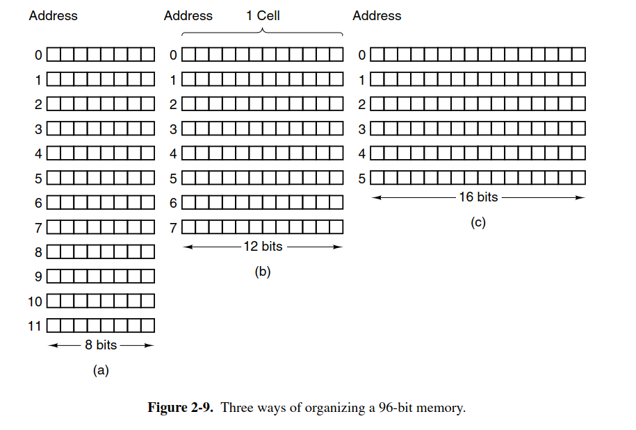

**memory** or **RAM** consist of a number of **cell**

**cell** is the smallest unit 

each address point to a cell

for example, a 64-bit machine means a cell use 64 bits, and cpu's register operate on 64-bit values

