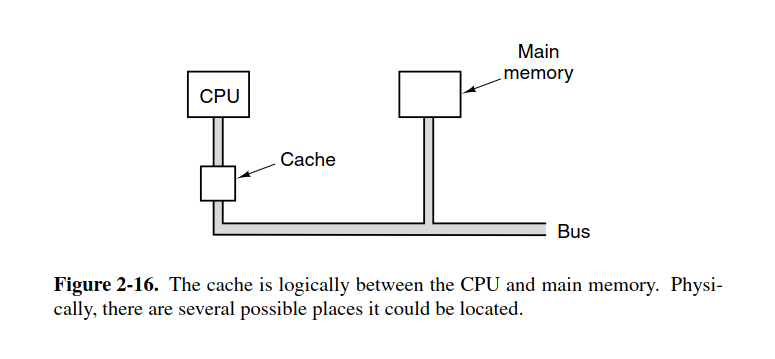

we have a problem, CPU processing time is much smaller than time to fetch data from memory. We have some solutions below:

1, start READ, then continue executing, and stall only if the CPU need that READ memory to arrive (fetch memory asynchronously)

- some issues with cache
  - cache size: the bigger the cache, the better, but slower and more cost
  - cache line size: 16KB cache can be divided to 1024 lines of 16 bytes size, or 2048 of 8 bytes size
  - how to organized the cache
  - whether instructions and data are kept in the same cache or different one

