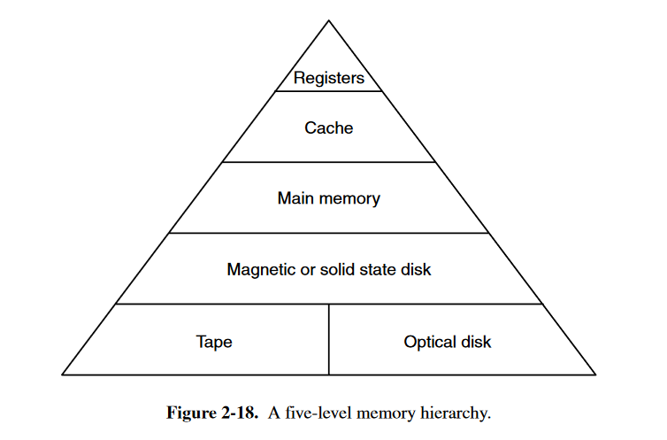
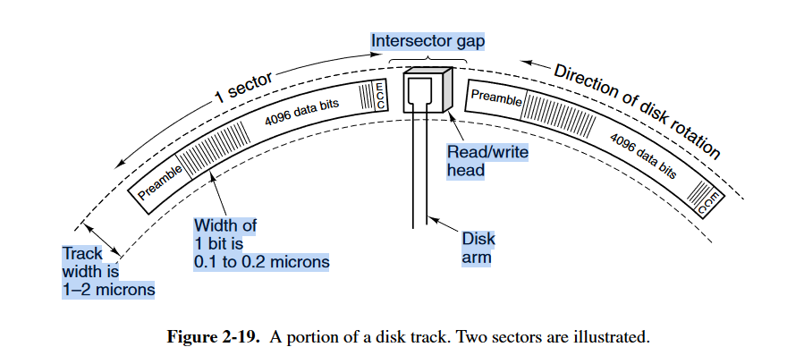
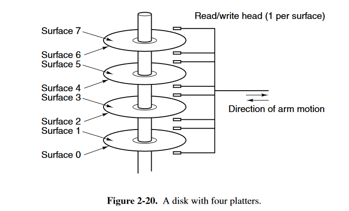
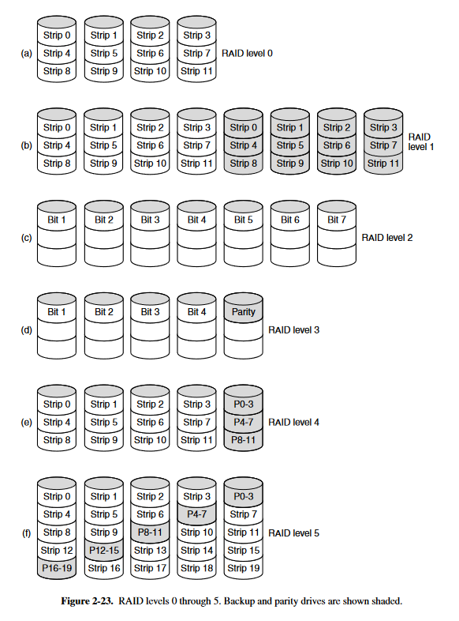

# memory hierarchies

# Magnetic Disk

A disk can contain 1 to 12 plate, which can be read and write separately

each rotation is called **track**, each track is divided into **sectors**, each sector contains fixed 512 data bytes

each disk has a moveable arm to read and write, main cost of disk is about **seeking**, which is too large on comparing to data transfer time

# RAID

redundant array of inexpensive disks

a simple idea here, if CPU can operate in parallel, so disks can as well

we can use a set of disks, and with a RAID controller instead of normal disk controller, we can let each disk operates separately, and this whole set of disks present to OS as a single disk

