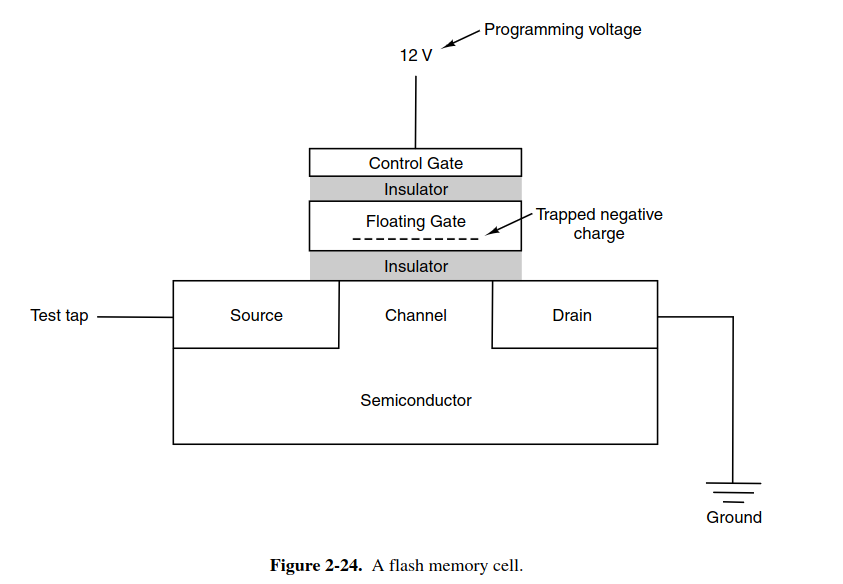

# memory hierarchies

# Magnetic Disk

A disk can contain 1 to 12 plate, which can be read and write separately

each rotation is called **track**, each track is divided into **sectors**, each sector contains fixed 512 data bytes

each disk has a moveable arm to read and write, main cost of disk is about **seeking**, which is too large on comparing to data transfer time

# RAID

redundant array of inexpensive disks

a simple idea here, if CPU can operate in parallel, so disks can as well

we can use a set of disks, and with a RAID controller instead of normal disk controller, we can let each disk operates separately, and this whole set of disks present to OS as a single disk

# solid-state drive

SSD components:
- controller: acting like a CPU, interacting with other components of computer
- mem table: mapping logical to physical address
- data chip: storing data
  
SSD sector size is the same as HDD's, 512 bytes per sector

SSD do not use spinning devices, so the **seeking** speed is removed, hence the performance is much better than HDD, but for electrons injection (electrons must go through the floating gate), the lifetime of SSD is much smaller

