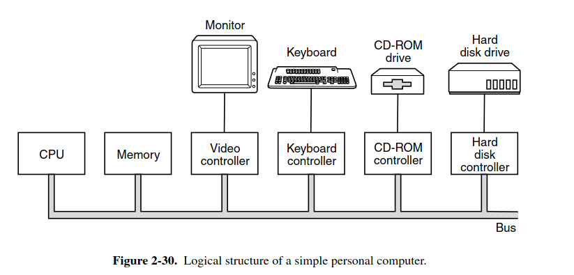
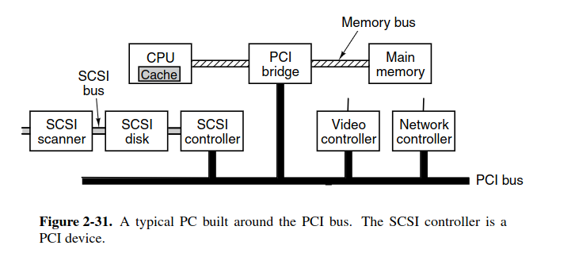

# Bus

bus handle data flow in the whole computer

each I/O device must connect to a controller, which handle data read or write into the memory, this operation can be completed without any help of CPU, this is called **Direct Memory Access** (DMA). But after every DMA, the CPU has to interrupt its current operation and check for any error happen to this I/O, if there is no error, the CPU will inform that I/O is finished. 

Why the CPU has to stop its running operation to handle interrupt for I/O? Because some spinning devices like disk can not be stopped (stopping may lead to lost data)

here is the simple design

a problem of this design is: CPU and Memory require much more bus traffic than others device in the system. So they need a separated high performance bus.

This leads to the new form, PCI architecture

